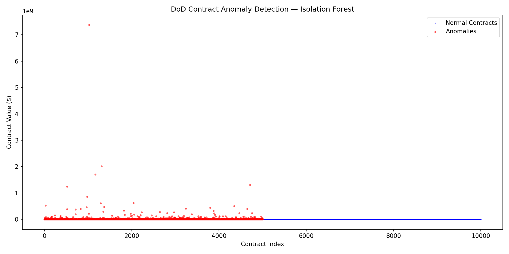
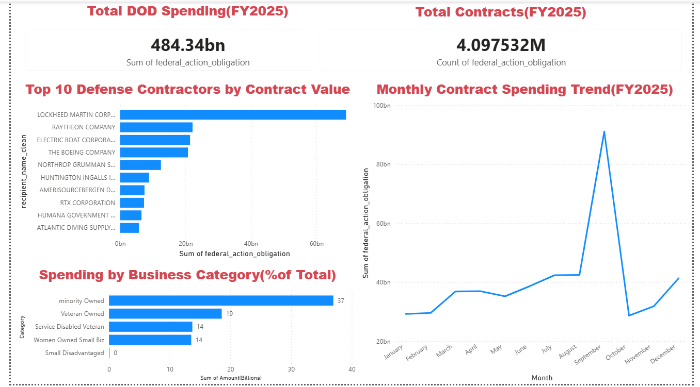
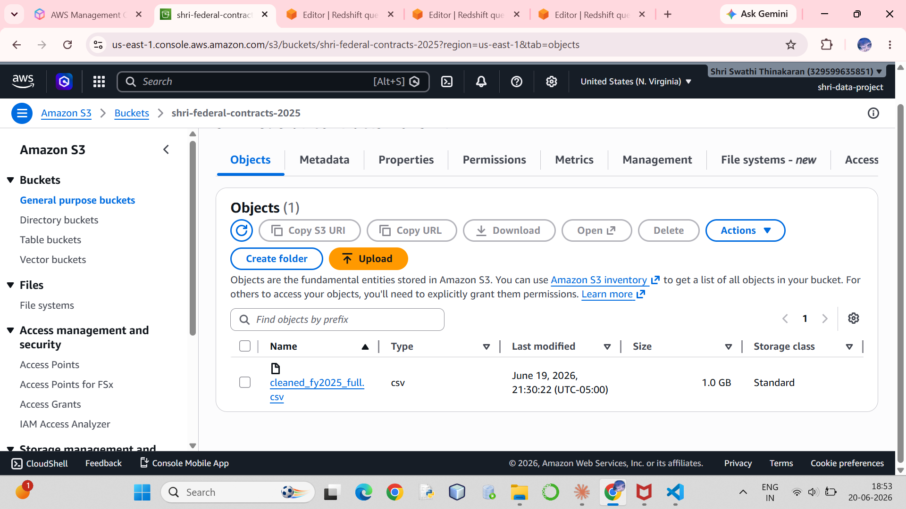
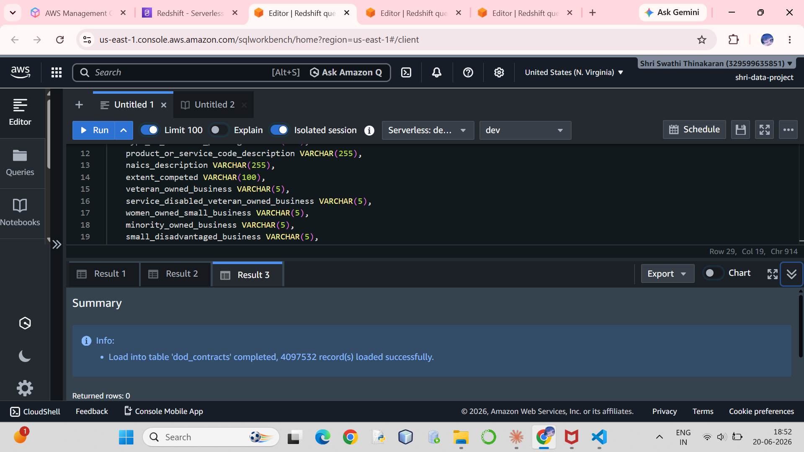
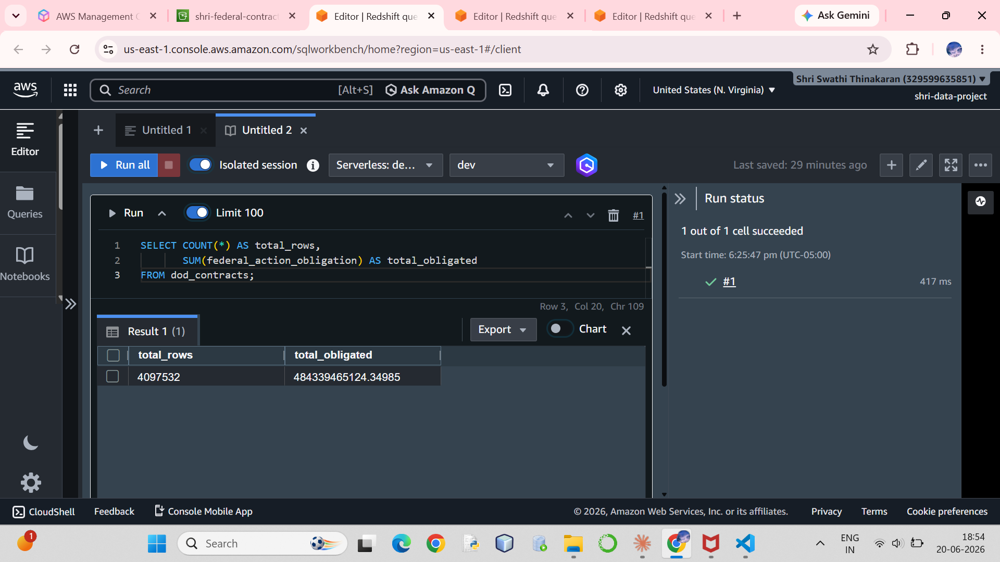

# Federal Contract Spending Dashboard — DoD FY2025

## Project Overview
Analysis of $484 billion in U.S. Department of Defense contract 
spending for fiscal year 2025 (4.1M+ transactions), uncovering 
vendor concentration and business equity gaps using Python, 
AWS, SQL, and Power BI.

## Key Findings
- **$484.3 billion** in total DoD contract obligations (FY2025)
- **Lockheed Martin** received $69B - 14.2% of all DoD spending
- **Small disadvantaged businesses** received just **0.01%** 
  ($55M) despite federal equity goals
- **Minority-owned businesses** captured 7.63% - the highest 
  among diversity categories
- **September spike** - massive year-end spending rush as 
  agencies exhaust fiscal year budgets

## Anomaly Detection Model

**Algorithm:** Isolation Forest (unsupervised ML)  
**Purpose:** Detect statistically unusual contract awards  
**Training data:** 4,097,532 contracts, 3 features  
**Contamination rate:** 1%

### Model Findings
- **40,952 contracts** flagged as anomalies (1% of total)
- **Largest single anomaly:** $14.1 billion — Lockheed Martin, Department of the Navy
- **Top anomalous vendor:** Lockheed Martin — consistent with concentration findings
- Model confirms extreme contract concentration is statistically anomalous

  

## Anomaly Detection Model

**Algorithm:** Isolation Forest (unsupervised ML)  
**Purpose:** Detect statistically unusual contract awards  
**Training data:** 4,097,532 contracts, 3 features  
**Contamination rate:** 1% (industry standard starting point)

### Model Findings
- **40,952 contracts** flagged as anomalies (1% of total)
- **Largest single anomaly:** $14.1 billion — Lockheed Martin, 
  Department of the Navy
- **Top anomalous vendor:** Lockheed Martin Corporation — 
  consistent with concentration findings from descriptive analysis
- Model confirms that extreme contract concentration among a 
  handful of vendors is statistically anomalous compared to 
  typical DoD contracting patterns  

## Tools & Technologies
- **Python** (Pandas, NumPy) - data cleaning and analysis
- **AWS S3** - cloud storage for processed data (1.0 GB)
- **AWS Redshift Serverless** - cloud database (4.1M rows loaded)
- **SQL** - data verification and querying
- **Power BI** - interactive dashboard

## Data Source
USASpending.gov - official U.S. federal spending data  
Dataset: Department of Defense Contracts, FY2025  
Records: 4,097,532 transactions

## Dashboard

## AWS Pipeline Proof

## Project Structure
federal-contract-dashboard/

├── Data/

│   └── cleaned_fy2025_full.csv

├── Notebooks/

│   └── 01_exploration.ipynb

├── Screenshots/

│   ├── 01_s3_upload.png

│   ├── 02_redshift_load_success.png

│   ├── 03_sql_verification_query.png

│   └── 04_dashboard_overview.png

└── README.md

## Key Technical Challenges
- Processed 5 raw CSV files (2GB each) using chunked loading 
  to avoid memory overflow
- Diagnosed and resolved a Redshift COPY failure caused by 
  column order mismatch between CSV and table schema
- Configured AWS IAM roles, security groups, and VPC settings 
  for Redshift Serverless access

## Author
Shri Swathi Thinakaran  
MS Information Systems, UMBC (May 2026)  
[LinkedIn](https://www.linkedin.com/in/shri-swathi-thinakaran-21b00a21a) | [GitHub](https://github.com/shriThinakaran/federal-contract-dashboard)